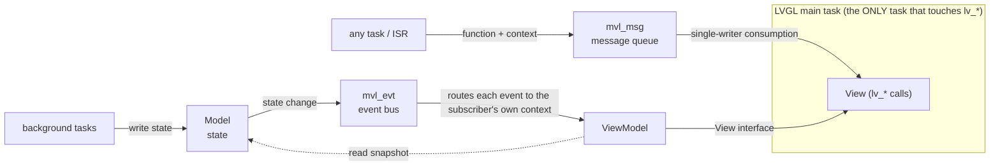

# MVL (MVVM-Lite)

A lightweight MVVM support library for **LVGL 8.x** on multitasking systems.

[中文文档](README_CN.md)

LVGL 8.x is **not thread-safe**: every `lv_*()` call must happen in one single
task. MVL turns that constraint into an architecture — the *single-writer
principle* — with two small mechanisms and one proven pattern:



- **`mvl_msg`** — thread-safe message queue. Any task/ISR posts
  `{function, context}`; only the LVGL task consumes. `lv_*()` is never called
  from the wrong thread again.
- **`mvl_evt`** — event bus. Subscribers choose their execution context:
  `MVL_EVT_CTX_LVGL` callbacks are dispatched into the LVGL task;
  `MVL_EVT_CTX_TASK` subscribers get the event in their own queue. Callbacks
  **never** run in the publisher's context. Fixed 8-byte value-copy payload —
  no pointer lifetime traps.
- **Model / ViewModel / View pattern** — proven skeletons in
  `examples/templates/`, plus `tools/mvl-gen` to generate them from a YAML
  wiring description with design-time static checks.

The library core is ~400 lines of pure C and depends only on `mvl_port.h`
(queue + critical section + assert). Reference ports: **ESP-IDF** (SMP-safe),
**vanilla FreeRTOS**, **POSIX** (host simulation and CI).

## Quickstart — run it on your PC (no hardware needed)

```sh
cmake -B build && cmake --build build
./build/examples/host_sim/host_sim   # full MVVM loop: scan → model → event → UI
cd build && ctest --output-on-failure
```

`host_sim` simulates the LVGL main task with a thread that periodically calls
`mvl_msg_process()` — exactly what an `lv_timer` does in a real firmware.

## Using it in your firmware

```c
/* 1. Boot order matters (see docs/user/pitfalls.md): infrastructure first */
mvl_msg_init();
mvl_evt_init();

/* 2. Pick a consumption point for mvl_msg_process():
   a) your own LVGL loop: call it periodically in the loop;
   b) esp_lvgl_port owns the loop: create an lv_timer in the LVGL task —
      semantically identical. */
lv_timer_create(dispatch_cb, MVL_MSG_DISPATCH_PERIOD_MS, NULL);

/* 3. From any task / ISR, safely update the UI: */
mvl_msg_post(my_ui_action, my_ctx);      /* runs in the LVGL task */

/* 4. Or go full MVVM: define events, subscribe, publish. */
mvl_evt_subscribe(EVT_WIFI_SCAN_UPDATED, on_scan, MVL_EVT_CTX_LVGL, NULL);
mvl_evt_publish(EVT_WIFI_SCAN_UPDATED, NULL);   /* from your WiFi task */
```

ESP-IDF: drop this repo into your project's `components/` directory — the
component registers itself with the `port/esp_idf` backend.
Other FreeRTOS: compile `src/` + `port/freertos/mvl_port.c`. New RTOS: implement
the 11 functions of [`mvl_port.h`](include/mvl/mvl_port.h) — see
[docs/user/porting.md](docs/user/porting.md).

## Why not LVGL 9's `lv_lock()`?

LVGL 9 adds a big-lock API (`lv_lock()/lv_unlock()`). MVL is a different
answer to the same question:

| | LVGL 9 `lv_lock()` | MVL (LVGL 8.x) |
|---|---|---|
| Model | any task locks, then calls `lv_*()` | only one task ever calls `lv_*()` |
| Failure mode | forgot to lock → rare, hard-to-reproduce corruption | structural — wrong context is impossible by construction |
| Latency | caller blocked on the lock | lock-free hand-off via queues |
| Design value | none (mechanism only) | MVVM wiring you can diagram, diff, and generate |

If you are on LVGL 9 with a simple UI, `lv_lock()` is fine. If you are on 8.x,
or your UI is driven by many background tasks and you want the wiring to be
*reviewable and testable*, MVL is for you.

## Repository layout

```
include/mvl/      public headers: mvl_msg.h, mvl_evt.h, mvl_port.h, mvl_config.h, mvl_version.h
src/              library core (~400 lines, pure C)
port/             posix / freertos / esp_idf reference ports
examples/host_sim PC demo, no hardware needed
examples/templates Model / ViewModel / View skeletons
tools/mvl-gen     YAML wiring → code generator with static checks
tools/mvl-studio  GUI YAML editor (optional, PySide6): tables → yaml → mvl-gen
tests/            host unit tests
docs/             design/ architecture design · user/ porting guide & pitfalls
```

## Documentation

- [docs/design/design.md](docs/design/design.md) — architecture and the single-writer principle
- [docs/user/porting.md](docs/user/porting.md) — porting to your RTOS, configuration macros
- [docs/user/pitfalls.md](docs/user/pitfalls.md) — the traps, learned on real hardware
- [tools/README.md](tools/README.md) — mvl-gen code generator and mvl-studio GUI editor

## License

MIT — see [LICENSE](LICENSE).
