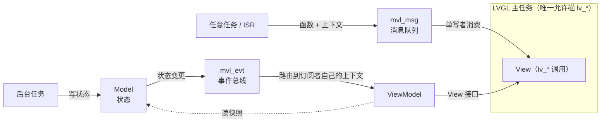

# MVL (MVVM-Lite)

适用于多任务系统上 **LVGL 8.x** 的轻量 MVVM 支持库。

[English README](README.md)

LVGL 8.x **不是线程安全的**：所有 `lv_*()` 调用必须发生在同一个任务里。
MVL 把这条约束变成架构——**单写者原则**——由两个小机制加一套经过真机
验证的模式组成：



- **`mvl_msg`** —— 线程安全消息队列。任何任务/ISR 投递「函数指针 + 上下文」，
  只由 LVGL 主任务消费执行。`lv_*()` 再也不会跑错线程。
- **`mvl_evt`** —— 事件总线。订阅者自选执行上下文：`MVL_EVT_CTX_LVGL`
  的回调经消息队列分发到 LVGL 主任务；`MVL_EVT_CTX_TASK` 的订阅者在自己
  的队列里收事件。回调**绝不**在发布者上下文执行。载荷固定 8 字节值拷贝，
  根除指针生命周期陷阱。
- **Model / ViewModel / View 模式** —— 经 ESP32-S3 真机验证的骨架在
  `examples/templates/`；也可用 `tools/mvl-gen` 从 YAML 接线描述生成，
  并带设计时静态检查。

库本体约 400 行纯 C，只依赖 `mvl_port.h`（队列 + 临界区 + 断言）。
自带参考移植：**ESP-IDF**（SMP 持锁临界区）、**vanilla FreeRTOS**、
**POSIX**（host 仿真与 CI）。

## 快速开始 —— 在 PC 上跑通（无需硬件）

```sh
cmake -B build && cmake --build build
./build/examples/host_sim/host_sim   # 完整 MVVM 链路：扫描 → Model → 事件 → UI
cd build && ctest --output-on-failure
```

`host_sim` 用一个周期调用 `mvl_msg_process()` 的线程模拟 LVGL 主任务——
这正是真实固件里 `lv_timer` 分发所做的事，语义完全一致。

## 在固件中使用

```c
/* 1. 启动顺序很重要（见 docs/user/pitfalls.md）：基础设施先行 */
mvl_msg_init();
mvl_evt_init();

/* 2. 选择 mvl_msg_process() 的消费点：
   a) 自管 LVGL 主循环：在循环内周期调用；
   b) esp_lvgl_port 托管主循环：在 LVGL 任务上下文创建 lv_timer 调用——语义等价 */
lv_timer_create(dispatch_cb, MVL_MSG_DISPATCH_PERIOD_MS, NULL);

/* 3. 任意任务 / ISR 中安全更新 UI： */
mvl_msg_post(my_ui_action, my_ctx);      /* 在 LVGL 主任务中执行 */

/* 4. 或走完整 MVVM：定义事件、订阅、发布 */
mvl_evt_subscribe(EVT_WIFI_SCAN_UPDATED, on_scan, MVL_EVT_CTX_LVGL, NULL);
mvl_evt_publish(EVT_WIFI_SCAN_UPDATED, NULL);   /* 在 WiFi 任务中调用 */
```

ESP-IDF：把本仓库放入工程的 `components/` 目录——组件自动启用
`port/esp_idf` 移植层。
其他 FreeRTOS：编译 `src/` + `port/freertos/mvl_port.c`。
新 RTOS：实现 [`mvl_port.h`](include/mvl/mvl_port.h) 的 11 个函数即可，
见 [docs/user/porting.md](docs/user/porting.md)。

## 为什么不用 LVGL 9 的 `lv_lock()`？

LVGL 9 提供了大锁 API（`lv_lock()/lv_unlock()`）。MVL 是对同一个问题的
另一种回答：

| | LVGL 9 `lv_lock()` | MVL（LVGL 8.x） |
|---|---|---|
| 模型 | 任意任务持锁后调 `lv_*()` | 永远只有一个任务调 `lv_*()` |
| 失效模式 | 忘了持锁 → 偶发、难复现的损坏 | 结构性保证——错上下文在构造上不可能 |
| 延迟 | 调用方阻塞等锁 | 队列接力，免锁 |
| 设计价值 | 无（纯机制） | MVVM 接线可画图、可 diff、可生成 |

如果你在 LVGL 9 上且 UI 简单，`lv_lock()` 足够。如果你在 8.x 上，或 UI
被多个后台任务驱动、希望接线关系**可评审、可测试**，MVL 正是为此而生。

## 仓库结构

```
include/mvl/      公共头文件：mvl_msg.h, mvl_evt.h, mvl_port.h, mvl_config.h, mvl_version.h
src/              库本体（约 400 行纯 C）
port/             posix / freertos / esp_idf 参考移植
examples/host_sim PC 演示，无需硬件
examples/templates Model / ViewModel / View 骨架模板
tools/mvl-gen     YAML 接线 → 代码生成器（含静态检查）
tools/mvl-studio  YAML 图形编辑器（可选，PySide6）：填表 → yaml → mvl-gen
tests/            host 单元测试
docs/             design/ 架构设计 · user/ 移植指南与陷阱合集
```

## 文档

- [docs/design/design.md](docs/design/design.md) —— 架构与单写者原则
- [docs/user/porting.md](docs/user/porting.md) —— 移植到新 RTOS、配置宏
- [docs/user/pitfalls.md](docs/user/pitfalls.md) —— 真机踩过的陷阱合集
- [tools/README.md](tools/README.md) —— mvl-gen 代码生成器与 mvl-studio 图形编辑器

## License

MIT —— 见 [LICENSE](LICENSE)。
