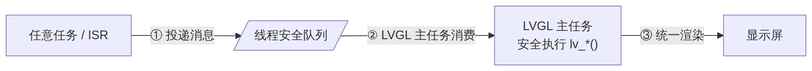
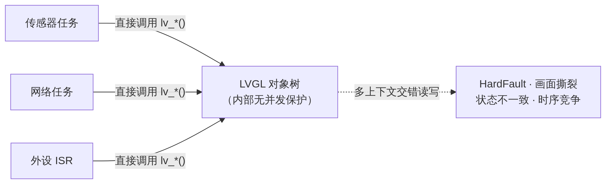
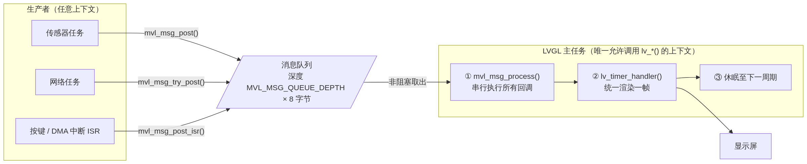
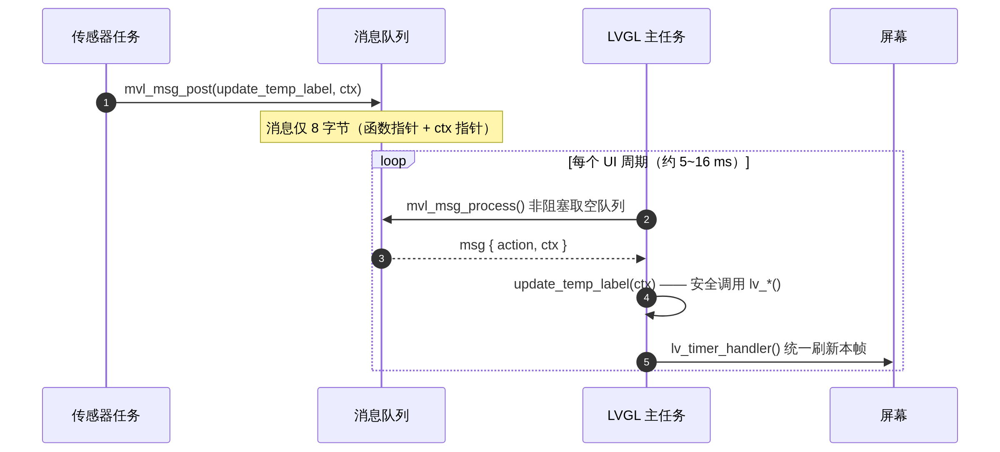
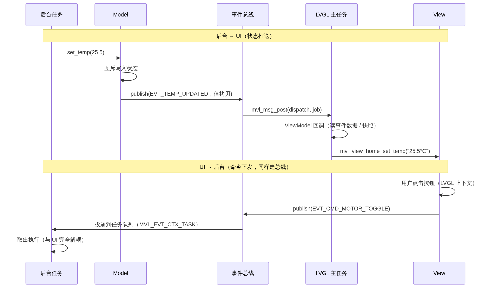

# MVL 架构设计文档

*LVGL 8.x 多任务系统的线程安全机制 + MVVM-Lite 分层解耦*

> **库定位**：MVL（MVVM-Lite）——适用于 LVGL 8.x 多任务系统的轻量 MVVM 支持库
> 
> **核心模块**：`mvl_msg`（消息队列，§3）· `mvl_evt`（事件总线，§4）· `mvl_port`（移植抽象，见 [porting.md](../user/porting.md)）
> 
> **适用环境**：LVGL 8.x + 任意 RTOS；平台差异由移植层吸收，本文内容平台通用
> 
> **配套文档**：[porting.md](../user/porting.md)（移植指南）· [pitfalls.md](../user/pitfalls.md)（陷阱合集）
> 
> **示例约定**：文中 `ui_xxx` 控件以 GUI Guider 生成工程为例，手写 UI 工程同样适用
> 
> **完整可运行示例**：`examples/host_sim/`（host 仿真，无硬件、无 LVGL 依赖即可跑通全链路）

---

## 0. 速览

**一句话**：LVGL 8.x 不是线程安全的。MVL 把所有外部上下文的 UI 操作打包成「函数指针 + 上下文指针」消息投递到队列，由 LVGL 主任务（唯一允许碰 LVGL 的线程）统一取出执行；再在其之上用事件总线 + MVVM-Lite 分层解决「谁该知道谁」的解耦问题。



<!-- 图源：docs/assets/design_01.mmd（mermaid），修改后重新渲染 PNG -->

三步接入：

| 步骤 | 动作 | 位置 |
|:---:|------|------|
| 1 | `mvl_msg_init()`（启用事件总线时再 `mvl_evt_init()`） | LVGL 初始化之后、任何投递之前 |
| 2 | 选定消费点：自管主循环插入 `mvl_msg_process()`，或托管组件下用 `lv_timer` 周期分发 | LVGL 主任务（§6） |
| 3 | 业务代码用 `mvl_msg_post()` / `mvl_evt_publish()` 触发 UI 更新 | 任意任务 / ISR |

---

## 1. 问题背景：LVGL 8.x 不是线程安全的

LVGL 8.x 的所有 `lv_*()` API（创建对象、修改属性、处理输入等）必须在**同一个线程上下文**中调用，通常就是 `lv_timer_handler()` 所在的任务（下称 **LVGL 主任务**）。

当多个任务（传感器采集、网络通信、DMA 中断等）都需要更新 UI 时，直接调用 LVGL API 的后果：



<!-- 图源：docs/assets/design_02.mmd（mermaid），修改后重新渲染 PNG -->

在双核 SMP 平台（如 ESP32-S3）上这不是小概率事件——两个核是**真并发**，可致堆损坏与随机崩溃。

---

## 2. 方案选型与边界

动手之前，先明确为什么选「消息队列」而不是其他路线：

| 方案 | 适用场景 | 优点 | 代价 / 风险 |
|------|----------|------|------------|
| **消息队列（MVL 采用）** | LVGL 8.x，多生产者 + ISR | 无锁、顺序确定、ISR 友好、易评审 | 异步语义，需要消费点接入（§6） |
| 互斥锁包裹 `lv_*()` | 生产者极少、无 ISR 更新 | 同步语义直观 | ISR 不能等锁；持锁渲染阻塞业务任务；漏包一处即崩；优先级反转风险 |
| 升级 LVGL 9（`lv_lock()` / `lv_unlock()`） | 可迁移的新项目 | 官方内置 OS 抽象，生态一致 | 8 → 9 迁移成本（API 有变动） |

本节对比的是「线程安全机制」的选型；机制之上的「架构解耦」（事件总线 / MVVM-Lite 分层）与机制正交，可叠加使用（§4、§5）。

---

## 3. 核心机制：mvl_msg 消息队列

### 3.1 设计原则

- **单写者原则**：任何时刻只有 LVGL 主任务读写 LVGL 对象树，竞争从机制上被消除
- **零拷贝**：消息只携带函数指针和上下文指针（32 位 MCU 共 8 字节），不拷贝业务数据
- **非阻塞消费**：主任务一次性取空队列，不阻塞 `lv_timer_handler()` 心跳
- **顺序执行**：消息按投递顺序（FIFO）执行，保证 UI 状态一致性

### 3.2 总体架构



<!-- 图源：docs/assets/design_03.mmd（mermaid），修改后重新渲染 PNG -->

图中 ① → ② → ③ 为一个 UI 周期，循环执行（消费点的两种接入形态见 §6）。

### 3.3 一条消息的旅程



<!-- 图源：docs/assets/design_04.mmd（mermaid），修改后重新渲染 PNG -->

### 3.4 API 与三种投递语义

接口定义见 `include/mvl/mvl_msg.h`：

| API | 调用上下文 | 队列满时行为 | 适用 |
|------|-----------|-------------|------|
| `mvl_msg_init()` | LVGL 初始化后调用一次 | — | 建队列 |
| `mvl_msg_post()` | 普通任务 | **永久阻塞**直到投递成功 | 关键事件（不丢） |
| `mvl_msg_try_post()` | 普通任务 | 立即返回 `false`，消息丢弃 | 高频可丢弃更新 |
| `mvl_msg_post_isr()` | ISR | 丢弃（ISR 禁止阻塞） | 中断上下文 |
| `mvl_msg_process()` | **仅 LVGL 主任务** | 非阻塞，一次性取空执行 | 消费点 |

两条铁律：

- **禁止在 LVGL 主任务（含回调）中调用 `mvl_msg_post()`**——队列满时会自我死锁；此时已在安全上下文，直接调 `lv_*()` 即可。详见 [pitfalls.md](../user/pitfalls.md) P1。
- **ISR 路径只能用 `_isr` 后缀版本**，且 ISR 版队列满时静默丢弃，关键告警类事件应保证队列深度或改走任务级阻塞投递。

典型用法（普通任务更新 UI）：

```c
/* 传感器任务中：投递 UI 更新到 LVGL 主任务 */
void sensor_task(void *pv)
{
    for (;;) {
        float temperature = read_temperature();
        mvl_msg_post(update_temp_label, (void *)(uintptr_t)(temperature * 100));
        vTaskDelay(pdMS_TO_TICKS(1000));
    }
}

/* 该函数在 LVGL 主任务中执行，可安全调用 lv_*() */
void update_temp_label(void *ctx)
{
    float temp = (float)(uintptr_t)ctx / 100.0f;
    char buf[32];
    snprintf(buf, sizeof(buf), "%.1f°C", temp);
    lv_label_set_text(ui_LabelTemp, buf);
}
```

**技巧**：用 `(void *)(uintptr_t)value` 直接传**数值**而非指针，零内存分配、零生命周期风险，适用于所有能塞进一个指针宽度的数据（int、float 位模式、枚举等）。

### 3.5 ctx 生命周期速查

回调执行是**异步**的——投递函数返回时，回调可能还没运行。因此 ctx 必须活到回调执行完：

| ctx 来源 | 安全性 | 说明 |
|----------|:---:|------|
| 局部变量指针 `&local` | ❌ 危险 | 回调执行时栈帧很可能已销毁，经典 HardFault 来源 |
| 数值强转 `(void *)(uintptr_t)v` | ✅ 推荐 | 零生命周期问题，仅限 ≤ 指针宽度的值 |
| `static` / 全局变量 | ✅ 安全 | 多个生产者共用同一 static 会互相覆盖，需注意 |
| 动态内存 `malloc` | ✅ 安全 | 所有权随消息转移，**回调内负责 `free`** |
| 双缓冲指针 | ✅ 推荐 | 大数据场景（如图像帧），缓冲区在回调执行完之前不得被覆写，消费完后交换 |

---

## 4. 事件总线：mvl_evt

### 4.1 为什么需要它

`mvl_msg` 解决的是**线程安全**问题：任何上下文都能安全地触发 UI 更新。但它不管**架构解耦**——`mvl_msg_post(update_temp_label, ...)` 意味着传感器任务必须知道界面上有个温度 Label、用什么格式、什么单位，生产者与 View 紧耦合。页面一多、状态来源一多，这种点对点关系会迅速失控。

事件总线在 `mvl_msg` 之上加一层薄抽象：生产者只陈述「发生了什么」，不关心谁在听。

### 4.2 三条设计要点

- **订阅回调永远在订阅者自己的上下文执行**——LVGL 订阅者经 `mvl_msg` 投递到 LVGL 主任务，任务订阅者投递到它自己的队列。绝不在发布者线程里直接执行回调，否则线程安全模型从后门被突破；
- **载荷值拷贝**（固定 8 字节），彻底绕开 §3.5 的生命周期问题；
- 订阅表**启动期静态注册**、运行期不增删，全程免锁。

### 4.3 事件 ID：由应用定义

**库不内置任何产品事件**。事件 ID 类型为 `uint16_t`（`mvl_evt_id_t`），由应用从 1 开始连续编号、按模块分段维护，且必须小于 `MVL_EVT_MAX_ID`（默认 128，见 [porting.md](../user/porting.md) §5）。ID 为 0 或越界时，订阅 / 发布直接返回 `false`。

```c
/* app_events.h —— 应用事件 ID 定义 */
typedef enum {
    EVT_NONE = 0,                    /* 0 保留 */

    /* 传感器段 1~31 */
    EVT_TEMP_UPDATED = 1,

    /* 网络段 32~63 */
    EVT_NET_STATE_CHANGED = 32,

    /* 命令段 96~（UI → 后台） */
    EVT_CMD_MOTOR_TOGGLE = 96,
} app_evt_id_t;
```

### 4.4 载荷：固定 8 字节值拷贝

```c
typedef union {
    int32_t  i32;
    uint32_t u32;
    float    f32;
    bool     b;
    uint8_t  raw[8];
} mvl_evt_data_t;
```

`mvl_evt_publish()` 把 `data` **值拷贝**进事件，发布后应用可立即复用 / 释放该内存。**禁止存放指向易失内存的指针**；超过 8 字节的数据（字符串、数组、图像帧）走「就绪事件 + Model 快照」模式（§5.4）。载荷违规的翻车现场见 [pitfalls.md](../user/pitfalls.md) P7。

### 4.5 两种订阅上下文

```c
typedef enum {
    MVL_EVT_CTX_LVGL = 0,  /* 回调在 LVGL 主任务执行，可安全调 lv_*() */
    MVL_EVT_CTX_TASK       /* 回调在订阅任务上下文执行，queue 为其接收队列 */
} mvl_evt_ctx_t;

bool mvl_evt_subscribe(mvl_evt_id_t id, mvl_evt_cb_t cb,
                       mvl_evt_ctx_t ctx, void *queue);
```

| 上下文 | `cb` | `queue` | 语义 |
|--------|------|---------|------|
| `MVL_EVT_CTX_LVGL` | 必填 | 传 `NULL` | 回调经 `mvl_msg` 投递到 LVGL 主任务执行（ViewModel 专用） |
| `MVL_EVT_CTX_TASK` | 传 `NULL` | 必填 | 事件值拷贝后直接投到订阅者队列，任务自行取出处理 |

`MVL_EVT_CTX_TASK` 的 `queue` 必须由 `mvl_port_queue_create()` 创建、元素类型为 `mvl_evt_t`（句柄类型须与移植层一致）：

```c
static void *motor_queue;

void motor_task_init(void)
{
    motor_queue = mvl_port_queue_create(4, sizeof(mvl_evt_t));
    mvl_evt_subscribe(EVT_CMD_MOTOR_TOGGLE, NULL, MVL_EVT_CTX_TASK, motor_queue);
}

void motor_task(void *pv)
{
    mvl_evt_t evt;
    for (;;) {
        mvl_port_queue_receive(motor_queue, &evt, MVL_PORT_WAIT_FOREVER);
        if (evt.id == EVT_CMD_MOTOR_TOGGLE) do_motor_toggle();
    }
}
```

订阅参数校验：`MVL_EVT_CTX_LVGL` 缺回调、`MVL_EVT_CTX_TASK` 缺队列、ID 为 0 或 ≥ `MVL_EVT_MAX_ID` 均返回 `false`；每事件订阅者超过 `MVL_EVT_MAX_SUBS_PER_EVT`（默认 4）返回 `false`。

### 4.6 LVGL 投递池

`mvl_msg` 的消息只携带两个指针，而事件要求值拷贝，二者之间存在结构性矛盾。总线内部为此维护一个**定长作业池**（深度 `MVL_EVT_LVGL_JOB_POOL_SIZE`，默认 8）：发布时把「回调 + 事件副本」整体写入池槽，再把池槽指针交给 `mvl_msg` 调度，在 LVGL 主任务执行完后归还。池槽的分配由 `mvl_port` 临界区保护，任务 / ISR 发布均安全。

池深 ≈ 单个分发周期内可能积压的 LVGL 事件数上限。**池满即丢弃**，并计入丢事件计数。

### 4.7 丢事件观测

```c
uint32_t mvl_evt_drop_count(void);
```

LVGL 投递池满、任务订阅队列满时事件被丢弃并累计到该计数。**正常系统应恒为 0**；调试期把它接入日志通道，非 0 说明池深 / 队列深度 / 事件频率需要回炉评估（高频源先合并，见 §8）。

---

## 5. MVVM-Lite 分层模式

> **定位**：保留 MVVM 的分层与单向数据流思想，去掉双向绑定、依赖注入等重机制的嵌入式裁剪版。线程安全模型不变——所有 `lv_*()` 依然只在 LVGL 主任务执行。
>
> **库 / 应用分工**：`mvl_msg`、`mvl_evt` 由库提供；Model、ViewModel、View 接口层是应用按本节模式手写的薄层（完整示范见 `examples/host_sim/`）。

### 5.1 分层架构与职责

```
   后台任务 / ISR（任意上下文，不认识 UI）
  传感器任务    网络任务    按键处理 …
       │ ① set_xxx() 写状态            ▲ ⑤ 命令事件投递到任务队列
       ▼                               │
╔══════════════════════════════════════════════════════════╗
║ 解耦层                                                     ║
║   Model（应用手写）：状态中心，互斥保护，唯一权威数据源        ║
║   mvl_evt（库提供） ：事件总线，按订阅者声明的上下文路由        ║
╚══════╤═══════════════════════════════════▲═══════════════╝
       │ ② 变更即发布状态事件                 │ ④ 用户操作 → 发布命令事件
       │ ③ 经 mvl_msg 投递到 LVGL 上下文      │
       ▼                               │
╔══════════════════════════════════════════════════════════╗
║ LVGL 主任务（唯一允许调用 lv_*() 的上下文）                  ║
║   ViewModel（订阅回调）                                     ║
║     → View 接口层（全工程唯一认识 ui_ 控件的地方）            ║
║       → View（GUI Guider 生成的 widgets + 事件绑定）         ║
╚══════════════════════════════════════════════════════════╝
```

| 层 | 归属 | 职责 | 禁止 |
|----|------|------|------|
| **View** | GUI Guider 生成代码 + 事件回调 | 展示；把用户操作翻译成命令事件发布 | 读写业务状态、引用后台队列 / 任务 |
| **View 接口层** | 应用手写（每页面一套 `mvl_view_xxx.h/.c`） | 语义化 UI 操作接口；唯一认识 `ui_` 控件的地方 | 包含业务逻辑、被后台任务引用 |
| **ViewModel** | 应用手写 | 订阅事件 → 读事件数据 / Model 快照 → 调 View 接口 | 直接操作 `ui_` 控件、业务计算、阻塞 |
| **Model** | 应用手写 | 集中持有系统状态；`set_xxx()` = 写状态 + 发事件 | 调用任何 `lv_*()` |
| **事件总线** | 库提供 `mvl_evt` | 事件分发，按订阅者声明的上下文路由 | 携带大数据（只带 ≤ 8 字节值拷贝） |
| **消息队列** | 库提供 `mvl_msg` | 一切 UI 操作的线程安全地基 | — |

**数据流**：后台写 Model → 发布状态事件 → ViewModel 经 View 接口刷新 View → View 发布命令事件 → 后台执行。双向都经过事件总线。

### 5.2 Model：状态中心（写状态 + 发事件）

规则只有一条：**状态字段只能通过 `set_xxx()` 修改**——函数内完成「写状态 + 发事件」的绑定，状态变更必然伴随事件，UI 永不漏刷新；UI 侧只通过 `snapshot()` 读互斥保护的整体快照。

```c
void app_model_set_temp(float t)
{
    lock();
    s_state.temperature = t;
    unlock();

    /* 先写后发：订阅者读到事件时，快照必已是新值 */
    mvl_evt_data_t d = { .f32 = t };
    mvl_evt_publish(EVT_TEMP_UPDATED, &d);
}
```

「先写后发」的顺序保证了订阅者在事件回调里读快照时拿到的必是包含本次变更的新值。

### 5.3 ViewModel / View 接口层 / View

**View 接口层**（每页面一个手写文件，全工程唯一认识 `ui_` 控件的地方）：

```c
/* mvl_view_home.c —— 唯一允许 include GUI Guider 头文件的手写文件 */
void mvl_view_home_set_temp(const char *text)
{
    lv_label_set_text(ui_LabelTemp, text);
}
```

**ViewModel**（回调注册为 `MVL_EVT_CTX_LVGL`，永远运行在 LVGL 主任务；只调 View 接口，不碰控件）：

```c
static void on_temp_updated(const mvl_evt_t *evt)
{
    /* 单字段刷新：直接用事件携带的数据，连 Model 都不用读 */
    char buf[32];
    snprintf(buf, sizeof(buf), "%.1f°C", evt->data.f32);
    mvl_view_home_set_temp(buf);
}

static void on_net_state(const mvl_evt_t *evt)
{
    /* 多字段联动：读 Model 快照，一处变更刷新一片 UI */
    app_state_t s = app_model_snapshot();
    mvl_view_home_set_net_state(s.net_connected);
}

void app_vm_init(void)
{
    mvl_evt_subscribe(EVT_TEMP_UPDATED,      on_temp_updated, MVL_EVT_CTX_LVGL, NULL);
    mvl_evt_subscribe(EVT_NET_STATE_CHANGED, on_net_state,    MVL_EVT_CTX_LVGL, NULL);

    /* 首屏 / 切页恢复：用快照经 View 接口初始化全量控件 */
}
```

### 5.4 大数据传输：「事件 + Model 快照」

事件载荷只有 8 字节，WiFi 扫描结果、长文本、图像帧这类数据**本体不走事件**。标准模式：

1. 后台把数据本体写入 Model（互斥保护）；
2. 发布一个「就绪事件」（载荷可传 `NULL` 或小摘要）；
3. 订阅者（ViewModel）在 LVGL 上下文经 `snapshot()` 读数据本体刷新 UI。

「先写后发」保证读到事件时快照已是新值。`examples/host_sim/` 的 WiFi 扫描链路即为该模式的完整实现。

不上事件总线、只用 `mvl_msg` 的场合，大数据用**双缓冲 + 指针传递**：消息只传缓冲区指针（如 `lv_img_set_src` 的图像数据源），配套要求是缓冲区在回调执行完之前不得被覆写——生产者写 A 缓冲时投递 B 缓冲指针，消费完后交换。

### 5.5 UI → 后台：命令也走总线

View 不再引用任何队列 / 任务句柄，用户操作统一翻译成 `EVT_CMD_*` 命令事件发布：

```c
/* GUI Guider 事件回调（LVGL 上下文）：只陈述意图，不关心谁处理 */
void on_btn_motor_clicked(lv_event_t *e)
{
    mvl_evt_publish(EVT_CMD_MOTOR_TOGGLE, NULL);
}
```

后台任务以 `MVL_EVT_CTX_TASK` 订阅（§4.5），事件在任务自己的上下文取出执行——这也顺带消除了「在 LVGL 任务里同步调用阻塞型后台 API」的整类事故（[pitfalls.md](../user/pitfalls.md) P5）。

**命令需要携带参数时**（如 WiFi 凭据，远超 8 字节载荷上限）：参数先写 Model，事件只作触发——

```c
/* View 回调（LVGL 上下文） */
app_model_set_pending_wifi_cred(ssid, password);   /* 参数入 Model，本身不发布事件 */
mvl_evt_publish(EVT_CMD_WIFI_CONNECT, NULL);        /* 事件只作触发 */

/* 处理任务（自己的上下文，从 Model 快照取参数） */
app_state_t s = app_model_snapshot();
net_connect(s.wifi_pending_ssid, s.wifi_pending_password);
```

需要**请求-响应**时（UI 要后台的处理结果）：处理任务执行完后再 `mvl_evt_publish()` 一个结果事件（由 ViewModel 订阅），UI 全程不阻塞。

### 5.6 完整回环



<!-- 图源：docs/assets/design_05.mmd（mermaid），修改后重新渲染 PNG -->

### 5.7 解耦边界：共享契约，不共享实现

完整 MVVM 的「双向绑定」在 C 语言里没有现成框架支撑，自造绑定表得不偿失。MVL 采用更务实的标准——**双方只共享契约，不共享实现细节**：

| 方向 | 共享的契约 | 不再共享的实现细节 |
|------|-----------|-------------------|
| 后台 → UI | 事件 ID、载荷语义（如 `EVT_TEMP_UPDATED` = 摄氏温度浮点） | 控件名、页面结构、LVGL 本身 |
| ViewModel → View | View 接口签名（`mvl_view_home_set_temp(const char *)`） | `ui_xxx` 控件实例 |
| View → 后台 | 命令事件 ID（`EVT_CMD_MOTOR_TOGGLE`） | 队列句柄、任务名、处理者位置 |

达到的效果：UI 改版只动 `mvl_view_xxx.c`；后台增删生产者只动各自的发布点；ViewModel 逻辑稳定、可独立评审。

---

## 6. 消费点接入（两种方式）

`mvl_msg_process()` 是唯一的消费入口，必须在 LVGL 主任务上下文周期执行。按工程形态二选一。

### 6.1 方式 A：自管 LVGL 主循环

GUI 任务主循环由自己编写时，把 `mvl_msg_process()` 插在 `lv_timer_handler()` **之前**：

```c
#include "mvl/mvl_msg.h"
#include "mvl/mvl_evt.h"

void gui_task(void *pvParameters)
{
    lv_init();
    /* 显示 / 输入移植初始化、UI 建树 … */

    mvl_msg_init();
    mvl_evt_init();                       /* 启用事件总线时 */

    for (;;) {
        mvl_msg_process();                /* ① 先消费全部消息 */
        uint32_t d = lv_timer_handler();  /* ② 再统一渲染本帧 */
        if (d == 0)  d = 1;               /* 至少让出 1 tick，避免空转打满 CPU */
        if (d > 20)  d = 20;              /* 上限兜底，保证消息被及时消费 */
        vTaskDelay(pdMS_TO_TICKS(d));     /* ③ 休眠至下一周期 */
    }
}
```

**为什么必须在 `lv_timer_handler()` 之前**：确保本周期内投递的所有 UI 修改**当帧生效**，由 `lv_timer_handler()` 统一刷新到屏幕。顺序颠倒时修改要等下一个周期才被渲染，表现为「UI 慢一帧」（[pitfalls.md](../user/pitfalls.md) P11）。

### 6.2 方式 B：托管组件（esp_lvgl_port）用 lv_timer 分发

有些移植层 / 组件把主循环封装在内部——例如 ESP-IDF 生态的 esp_lvgl_port（`lvgl_port_task` 中 `lock → lv_timer_handler() → unlock`）。这类组件**不应去改**（修改会在升级时被覆盖）。

通用解法：**用 `lv_timer` 做周期分发**。`lv_timer` 回调本身就运行在 LVGL 主任务上下文（`lv_timer_handler()` 的定时器处理阶段、渲染之前），与移植层形态无关，语义与「主循环插入」等价：

```c
/* LVGL 初始化完成后，在持有移植层锁的上下文创建（如 ui_load() 内） */
static void msg_dispatch_timer_cb(lv_timer_t *timer)
{
    (void)timer;
    mvl_msg_process();               /* 与手写主循环等价的消费点 */
}
lv_timer_create(msg_dispatch_timer_cb, MVL_MSG_DISPATCH_PERIOD_MS, NULL);
```

代价与收益：

- 最坏消费延迟 ≈ 分发周期 + 一个刷新周期（实例：30ms + 40ms，人机交互无感知）；对延迟敏感可缩短分发周期
- 零侵入移植层，组件升级不影响
- 若移植层的锁为递归互斥锁（esp_lvgl_port 即是），LVGL 任务运行 `lv_timer_handler()` 时已持有锁，分发回调内无需（但可以无害地）再次加锁

使用移植层提供的锁之前务必确认其超时参数语义（esp_lvgl_port 的 `lvgl_port_lock(0)` 是**无限等待**而非「试一下」），启动期建树的持锁细节见 [pitfalls.md](../user/pitfalls.md) P10。

---

## 7. 启动顺序

```
mvl_msg_init() → mvl_evt_init() → Model 初始化 → ViewModel 完成全部订阅 → 最后创建后台任务
```

- `mvl_evt_init()` 会**清零订阅表**，必须先于任何订阅动作；
- 后台任务最后启动，保证事件不会早于订阅到达；
- 工程化建议：前三步（基础设施）在 `app_main` 中集中完成，且先于任何会订阅 / 发布事件的模块初始化。

违反顺序的真机事故（订阅表被初始化清零覆盖、事件全丢）见 [pitfalls.md](../user/pitfalls.md) P8。

---

## 8. 性能与容量

| 指标 | 说明 |
|------|------|
| 消息大小 | 两个指针（32 位 MCU 共 8 字节），仅一次入队拷贝，出队直接执行，无二次拷贝 |
| 队列深度 | `MVL_MSG_QUEUE_DEPTH`（默认 16）。估算：生产者数 × 单消费周期内最多投递条数。高频场景优先合并，而非单纯加深队列 |
| 消费延迟 | 方式 A：最坏 ≈ 一个 UI 周期（通常 5~16 ms）；方式 B：≈ 分发周期 + 一个刷新周期 |
| 阻塞行为 | `mvl_msg_post()` 队列满时永久阻塞；`mvl_msg_try_post()` 立即失败；ISR 版丢弃 |
| 订阅表 RAM | ≈ `MVL_EVT_MAX_ID × MVL_EVT_MAX_SUBS_PER_EVT × sizeof(sub_t)`，默认配置约 8 KB（32 位平台） |

**高频更新：合并而非狂投**。1 kHz 采样的传感器，UI 只需要 10 Hz 刷新。不要每毫秒投递一次——队列会被刷屏，反而挤占渲染时间。推荐「最新值 + 低频消费」模式：

```c
static volatile float s_latest_temp;   /* 生产者只写最新值，不投递 */

void sensor_task(void *pv)
{
    for (;;) {
        s_latest_temp = read_temperature();
        vTaskDelay(pdMS_TO_TICKS(1));      /* 1 kHz 采集 */
    }
}

/* 由 lv_timer 或低频投递触发，100 ms 刷一次 UI */
void refresh_temp_label(void *ctx)
{
    char buf[32];
    snprintf(buf, sizeof(buf), "%.1f°C", s_latest_temp);
    lv_label_set_text(ui_LabelTemp, buf);
}
```

启用事件总线时同理：高频源先合并再发布，事件频率不应超过 UI 帧率，否则投递池与消息队列都会被刷屏。

---

## 9. 库与应用的分工

| 提供方 | 内容 |
|--------|------|
| **库** | `mvl_msg`（消息队列）、`mvl_evt`（事件总线）、`mvl_port`（移植抽象）+ `port/` 下三个参考移植 |
| **应用** | Model（状态中心）、ViewModel、View 接口层——按 §5 模式手写的薄层；事件 ID 定义（§4.3） |

`examples/host_sim/` 是完整链路的 host 仿真：包含应用侧 Model / ViewModel / View 的参考写法、WiFi 扫描大数据走「事件 + Model 快照」、UI → 后台命令事件，以及正确的启动顺序，无需硬件即可运行并接入 CI。
